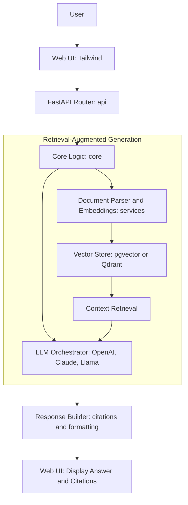

# 🧭 Product Requirements Document (PRD)
## **Travel Roboto: AI-Powered Travel Assistant**

---

## 1. Product Summary

**Travel Roboto** is an AI-powered travel assistant that transforms how travelers interact with their itineraries and trip documents. Instead of digging through emails, PDFs, and scattered notes, users can simply *ask questions* — “What’s my hotel check-in time?” or “Which airport do I fly into?” — and receive accurate, contextual answers drawn directly from uploaded travel documents and prior chat context.

The core problem it solves is **travel information fragmentation** — when key trip details are buried across multiple sources. Travel Roboto provides a conversational layer that centralizes access, enabling users to query their travel data naturally and intuitively.

**Value proposition:** Simplify trip organization and reduce travel stress through an intelligent, document-aware chatbot that understands your plans.

---

## 2. Goals & Non-Goals

### 🎯 Goals

| Objective | Description | Success Metric |
|------------|--------------|----------------|
| **Contextual Q&A** | Users can ask questions about travel plans based on uploaded docs or emails. | ≥ 90% of test queries return correct or relevant info |
| **Document-Aware Chat** | Enable RAG (Retrieval-Augmented Generation) with vector embeddings. | Latency ≤ 2.5s for average-length responses |
| **Stateless Architecture** | API remains stateless; all state handled client-side or via vector retrieval. | No server session state required |
| **Explainable Responses** | Model cites sources (filename + line reference). | Citations available in ≥ 80% of document-derived answers |
| **Professional Engineering Quality** | Code meets AI engineering best practices for modularity, clarity, and reliability. | Passes code reviews (ruff, mypy, pytest coverage ≥ 80%) |

### 🚫 Non-Goals

- Persistent long-term user memory or multi-device sync  
- Advanced user authentication or team collaboration features  
- Payment, billing, or large-scale infrastructure scalability  
- Full conversational personalization or recommendation engine  

---

## 3. User Personas & Use Cases

### 👩‍💼 Persona 1: Travel Organizer (Planner)

- Often books flights, hotels, and activities for group trips  
- Needs to upload confirmations (PDFs, emails) and verify logistics  
- Values organization, accuracy, and ease of retrieval  

**Key use cases:**
- Upload multiple travel confirmations  
- Ask questions like “What’s the total cost of hotels?” or “Do all flights arrive at the same airport?”  
- Get source citations for peace of mind  

### 🧳 Persona 2: Trip Participant (Traveler)

- Wants quick answers about itinerary details without checking documents  
- Uses mobile web to chat before or during travel  

**Key use cases:**
- Ask “What time is check-in?” or “Do I have free breakfast?”  
- Search by date or keyword (“Show events on June 14”)  
- View citations or summary of a document  

---

## 4. System Architecture Overview

### 🏗️ Architecture Principles

- **Stateless FastAPI backend:** Each request is self-contained; no server memory of past interactions  
- **Composable modularity:**
```
TBD - Placeholder below...
app/
├── api/              # FastAPI routers and Pydantic schemas
├── core/             # LLM logic, RAG orchestration, prompt construction
├── services/         # Document parsing, embeddings, retrieval utilities
├── infrastructure/   # Database engine, storage, external API clients
├── interfaces/       # Web UI and frontend adapters
└── schema/           # Shared Pydantic models and validation rules
```

### ⚙️ Data Flow

1. **Frontend** (Tailwind web UI) sends user query + relevant context  
2. **FastAPI Router** receives and validates via Pydantic models  
3. **Core Layer** invokes the LLM orchestration logic:
   - Retrieve relevant embeddings from vector DB  
   - Construct contextual prompt (query + retrieved snippets)  
   - Call OpenAI (or other) LLM API  
4. **Service Layer** handles document ingestion:
   - Parse files (PDF, text, email)  
   - Generate embeddings and store in vector DB  
5. **Response** includes answer + citations; returned to UI via REST (and optionally WebSocket for streaming)

### 🔍 Vector Retrieval

- **Alpha:** pgvector on PostgreSQL (co-located with main DB)  
- **Beta:** upgrade to **Qdrant** for higher recall and filtering  

---

## 5. Functional Requirements

| Feature | Description | Priority |
|----------|--------------|-----------|
| **Document Upload & Parsing** | Support text, PDFs, and email content extraction | P0 |
| **Text Chunking & Embedding** | Split and embed text using OpenAI or HuggingFace model | P0 |
| **Vector Retrieval (RAG)** | Retrieve top-K relevant chunks based on similarity | P0 |
| **Contextual Q&A** | Combine query + retrieved context to form LLM prompt | P0 |
| **Citation Generation** | Include filename and page/line references | P1 |
| **Client-side History** | Cache chat locally (no server session) | P1 |
| **Error Handling** | Graceful handling of timeouts, bad inputs, or missing docs | P0 |
| **Structured Logging** | JSON logs with request_id, latency_ms, route | P0 |
| **Rate Limiting** | Basic per-user or per-IP protection | P1 |

---

## 6. Non-Functional Requirements

| Category | Requirement |
|-----------|--------------|
| **Performance** | Avg API latency < 2.5s for standard LLM responses |
| **Reliability** | ≥ 99% uptime target during active demo |
| **Observability** | Structured logs, correlation IDs, request latency metrics |
| **Privacy** | No PII stored; documents deleted after session (GDPR-aligned) |
| **Accessibility** | Clean web UI, minimal friction for uploads and Q&A |
| **Usability** | Conversational tone, human-readable citations, clear feedback for errors |

---

## 7. Technical Stack & Integrations

| Layer | Technology | Purpose / Rationale |
|-------|-------------|----------------------|
| **Backend Framework** | FastAPI (Python 3.11+) | Async, type-safe, lightweight REST framework ideal for stateless services |
| **Deployment** | Railway | Simple cloud deployment for portfolio-scale demo |
| **LLM Integration** | OpenAI API (GPT-4/4o) for alpha; add Anthropic Claude and open-source (e.g., Llama) for beta | Demonstrates multi-provider orchestration and prompt portability |
| **Orchestration Library** | LangChain or PydanticAI | Abstract prompt construction, RAG logic, and model invocation |
| **Database** | PostgreSQL | Central relational store for metadata and vector embeddings |
| **Vector Store** | pgvector → Qdrant (upgrade path) | Scalable embedding retrieval with smooth migration path |
| **Frontend** | Tailwind CSS + Vanilla JS | Lightweight, minimal UI emphasizing chat usability |
| **Logging** | Python `structlog` | Structured, context-aware observability |

### Why This Stack Works for Stateless Design

All state (conversation history, embeddings context) is externalized:
- Message state: stored in client browser  
- Document state: embedded into vector store  
- Each API request fully reconstructs context → ensures pure statelessness  

---

## 8. Future Enhancements

| Feature | Description | Potential Impact |
|----------|--------------|------------------|
| **Persistent Conversation Memory** | Store prior turns in vector memory to simulate continuity | Improved personalization |
| **Multi-Document Querying** | Simultaneous reasoning across multiple sources | Richer insights |
| **Role-Based Access** | Different privileges for organizers vs participants | Security, team collaboration |
| **Analytics Dashboard** | Visualize usage, query patterns, and LLM performance | Product iteration insights |
| **Multimodal Input** | Extract details from images (boarding passes, QR codes) | Broader data ingestion |
| **Offline Embedding Generation** | Reduce latency and cost by precomputing embeddings locally | Scalability, cost control |

---

## 9. Risks & Mitigations

| Risk | Description | Mitigation |
|------|--------------|-------------|
| **LLM Context Drift** | Model misinterprets user intent after long chats | Stateless design + context window trimming |
| **Token Costs** | Excessive prompt size increases cost | Chunking + embedding filtering to minimize token load |
| **API Rate Limits** | External LLM providers throttle requests | Add backoff + caching |
| **Privacy Concerns** | Uploaded travel docs may contain sensitive info | Ephemeral storage + auto-deletion after session |
| **Parsing Errors** | PDF extraction errors lead to missing data | Use multi-library fallback (e.g., pdfminer + PyMuPDF) |

---

## 10. Appendix (Optional)

### 📘 API Endpoint Summary

| Endpoint | Method | Description |
|-----------|--------|-------------|
| `TBD` | POST | Upload travel documents for parsing and embedding |
| `TBD` | POST | Submit a question; returns contextual answer + citations |
| `TBD` | GET | Health check for uptime monitoring |

### 🔄 High-Level Data Flow



---

## 🌍 Product Vision Summary

*Travel Roboto reimagines travel planning as a conversation — bridging the gap between structured itineraries and natural language understanding. It demonstrates how modern AI engineering can turn scattered travel data into intelligent, conversational assistance that feels personal, reliable, and effortless.*

